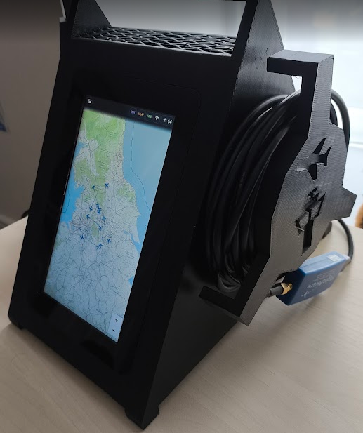
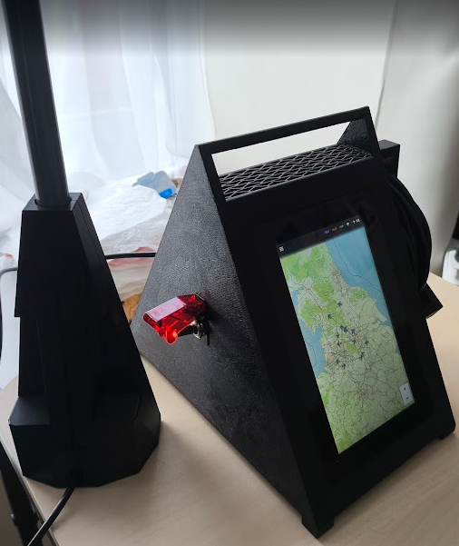

# Raspberry Pi ADS-B Flight Tracker

An offline-first aircraft tracking appliance built around a Raspberry Pi 3B+.
It receives live ADS-B broadcasts, renders aircraft on locally stored maps, and
runs a purpose-built touchscreen interface without depending on an Internet
connection. The software and hardware were designed together for quick startup,
responsive map interaction on constrained hardware, and safe appliance-style
shutdown.

<p>
  
  
</p>

## Hardware

The electronics are housed in a custom-designed, 3D-printed enclosure with an
integrated carrying handle, ventilation, touchscreen surround, and side cable
storage. The main components are:

- Raspberry Pi 3B+
- Raspberry Pi Touch Display 2
- 32 GB SanDisk USB boot drive
- [FlightAware Pro Stick Plus USB SDR ADS-B receiver](https://thepihut.com/products/flightaware-pro-stick-plus-usb-sdr-ads-b-receiver)
- [60 cm 1090 MHz ADS-B antenna](https://thepihut.com/products/60cm-1090mhz-antenna-for-ads-b)
- Illuminated latching toggle switch
- 12 V external power supply
- Custom delayed-shutdown and power-control circuit

The power circuit uses a TRM01 time-delay relay module, IRF4905 P-channel
MOSFET, 2N2222 transistor, resistor divider for the GPIO shutdown signal, and an
LDO03C DC-DC converter. Turning the illuminated switch on powers the Pi normally.
Turning it off does not abruptly remove power: the circuit signals a GPIO input,
keeps the supply alive for roughly 20 seconds while Linux shuts down cleanly,
then disconnects power after the delay expires. This gives the finished unit
the behaviour of an appliance while protecting the USB boot filesystem.

## Software overview

The runtime is deliberately lean: Alpine Linux, `dump1090`, `lighttpd`, a
Chromium kiosk, and static HTML/CSS/JavaScript. Regional maps are stored locally
as PMTiles and prerendered raster tiles, avoiding network latency and keeping
map interaction responsive on the Pi 3B+.

When online, a separate supervised worker prewarms aircraft and route details
for active positioned aircraft. It uses ADSBDB's combined lookup, permits only
one upstream request every five seconds, caches aircraft for 30 days and routes
for 24 hours, caches misses for six hours, and backs off for 30 minutes if the
provider rate-limits it. The touchscreen reads only the persistent local cache,
so opening an aircraft card is immediate and previously cached details remain
available offline. Airport country flags are bundled locally from the
MIT-licensed [flag-icons](https://github.com/lipis/flag-icons) project.

## Layout

- `web/` – Polish portrait touchscreen interface
- `config/flight-tracker.conf` – receiver and map configuration
- `openrc/` – supervised Alpine services
- `lighttpd/flight-tracker.conf` – local web server configuration
- `scripts/install-alpine.sh` – idempotent on-device installer
- `scripts/deploy.sh` – copy this checkout to `mamaloty` and install it
- `scripts/build-map.sh` – create the deployment PMTiles extract
- `tests/smoke.sh` – local/remote HTTP and JSON smoke checks

## Deploy

```sh
./scripts/deploy.sh mamaloty
```

The tracked configuration files use approximate city-centre coordinates so a
public checkout does not disclose a receiver's precise location. For a real
deployment, copy a profile to `config/flight-tracker.local.conf`, enter the
exact receiver values there, and deploy. This local file is ignored by Git but
is included by the deployment script. Both commissioning and final maps are
local PMTiles archives and do not require Internet access.

Deployments compare the committed checksum manifests with those on the Pi.
Large PMTiles archives and prerendered raster trees are transferred only when
their checksum changes; ordinary application updates skip them.

The installer does not overwrite Tailscale, SSH, GPIO shutdown, networking, or
boot files. It changes the kiosk URL to `http://127.0.0.1:8080/` and retains the
original `.xinitrc` as `.xinitrc.pre-flight-tracker` on first deployment.

## Runtime endpoints

- `/` simplified Polish UI
- `/data/aircraft.json`, `/data/receiver.json`, `/data/stats.json` live decoder data
- `/diagnostics/` packaged SkyAware interface
- `/maps/sheffield.pmtiles` offline commissioning map
- `/maps/sheffield-raster-{en,pl}/` pre-rendered fast kiosk tiles
- `/maps/wroclaw.pmtiles` offline final deployment map
- `/api/mlat.py?action=status` loopback-only optional MLAT status
- Beast output TCP 30005 and MLAT return input TCP 30104

The core tracker remains entirely local and works without Internet. ADSB.lol
MLAT is off by default. It can only be enabled explicitly in the Wi-Fi dialog
after entering the antenna height and confirming terrain elevation from
Open-Meteo (Copernicus DEM GLO-90). When enabled, the supervisor starts the
privacy-mode client only while `wpa_supplicant` is connected. Privacy mode
hides the receiver publicly, but ADSB.lol still receives its precise
coordinates and elevation.

The selected-aircraft panel includes local bearing/elevation guidance,
contextual MLAT/heavy/helicopter/emergency badges, and a collapsed specialist
telemetry drawer. Touch the aircraft count for the in-browser daily station
summary; its checkpoint is written at most once every five minutes and resets
at local midnight.

Run local calculation, API, Python, and shell checks with `./tests/run.sh`.

## Recreating a checkout

The repository contains all application source, service definitions, tests,
pinned browser dependencies, and build scripts. It deliberately does not
contain passwords, device state, or generated map data. Wi-Fi credentials stay
on the Pi in `/etc/wpa_supplicant/wpa_supplicant.conf` and runtime state stays
under `/var/lib/flight-tracker`.

To prepare a fresh checkout:

1. Run `./scripts/fetch-vendor.sh` if the pinned files in `vendor/` need to be
   restored or refreshed.
2. Install the `pmtiles` CLI and obtain a source PMTiles archive or URL.
3. Run `./scripts/build-map.sh SOURCE sheffield` and/or
   `./scripts/build-map.sh SOURCE wroclaw`. The script extracts the configured
   region at zoom levels 5–12, verifies it, and writes a checksum manifest.
4. Optionally generate the faster raster tile trees with
   `scripts/render-raster-map.py`; run it with `--help` for its required source,
   language, and output arguments. Raster trees are generated artifacts and
   are also excluded from Git.
5. Select a deployment profile by copying the appropriate file from
   `config/profiles/` to `config/flight-tracker.local.conf`, enter the precise
   receiver location locally, then run
   `./scripts/deploy.sh mamaloty`.

The committed `maps/*.sha256` manifests record the expected locally generated
map outputs without storing the large artifacts themselves.
